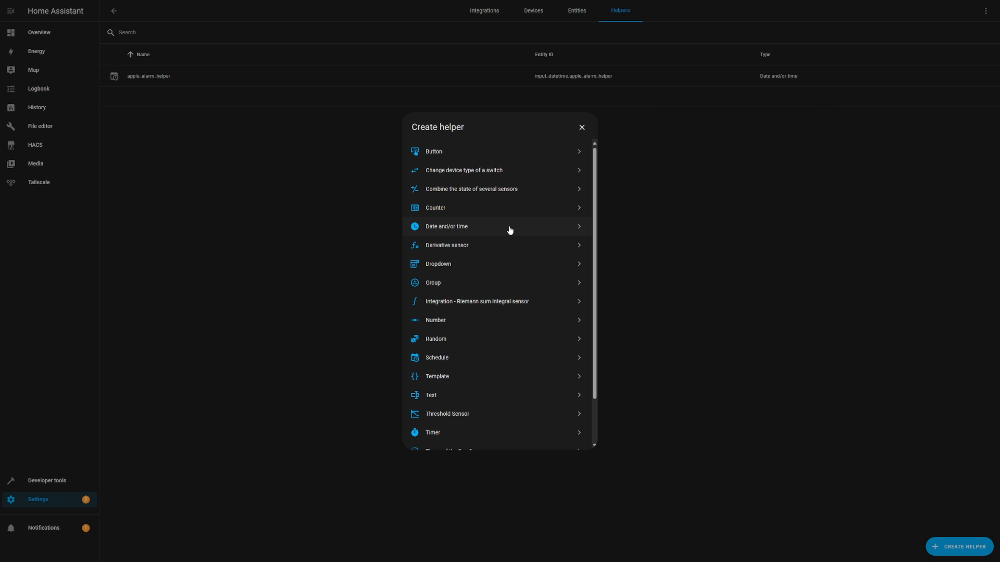
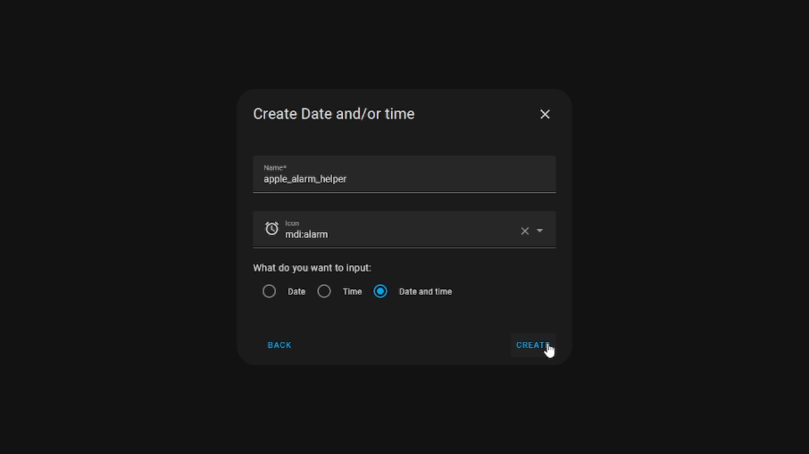

Final Result:  


## System Overview

1. Set a morning alarm on your iPhone
1. Home Assistant receives this through an Apple shortcut
1. a set amount of minutes before alarm, lights turn on, and shift from warm to daylight, as well as brighten.
1. ???

# Setting up Helper In HA

[Settings > Devices & Services > Helpers](https://my.home-assistant.io/redirect/helpers/)

1. Create a new helper, and select Date and/or time  
   
1. Make sure you select **Date and time** for the input that's VERY important for this to work.  
     
   Now that you've added a Helper for the apple alarm. what you'll want to do is add the shortcut on mobile.  
   [HA Sync iOS 17 Sleep Alarm Shortcut](https://www.icloud.com/shortcuts/e71ab4d7795b4283833e9b0ee7d8b140)

Once you have added the shortcut, you will need to grant it access to the HA app and allow the service to call the clock as well. To prompt this, you can either try running the automation or tap the "i" button at the bottom of the screen.  
Please note that this shortcut has only one value that may require change by the end user, which is the name set for the helper. By default, it is set as "input_datetime.apple_alarm_helper," so it will work without any changes if you had named the helper "apple_alarm_helper" in HA.

Once you have made any required adjustments, give the shortcut a try to test its functionality. If it is working properly, you will notice the time in the HA helper changing accordingly.


Now that we've gotten the alarm value in the helper working. We should add a few automations on the shortcuts app so we're not having to manually run the shortcut every night. The two automations that I like to add are:

1. When Clock app closes run HA Sync iOS 17 Sleep Alarm Shortcut
1. At 3AM run HA Sync iOS 17 Sleep Alarm Shortcut
   1. (if you dont have a scheduled time send, the HA wont do regular alarms) 

# Final Stretch for HA

Now that we have completed the setup, we can proceed to the HA alarm system. This system is divided into two parts. The first part is an Automation located under "Automations & Scenes". It triggers the light management script at the designated time - the offset in minutes.

The general gist of the automation operates by regularly checking if the current time matches the specified offset_minutes value. As an example if you set the value to 40, the lights will kick on at low levels and a warmer hue 40 minutes before the alarm. 

### Automation: Toggle Light Based on Alarm Time

````
alias: Toggle Light Based on Alarm Time
description: Turn on light based on the alarm time difference.
trigger:
  - platform: time_pattern
    minutes: /1
condition:
  - condition: template
    value_template: >
         
        true
      
        false
      
action:
  # - condition: zone
  #  entity_id: device_tracker.CHANGEME # change this to the correct device
  #  zone: zone.home
  - service: script.turn_on
    target:
      entity_id: script.wled_alarm_brightness_and_color_temperature
    data:
      variables:
        offset_minutes: "{{ offset_minutes }}"
variables:
  offset_minutes: 40 # this is the time its offset by, so 40 is 40 minutes before alarm
mode: single
````

If you make any changes to the setup, these are the values that you might need to modify.

````
as_timestamp(states('input_datetime.apple_alarm_helper'))
````

There is also the entity_id which is the script name that controls the lights

````
entity_id: script.wled_alarm_brightness_and_color_temperature
````

Additionally, there is a device tracker that ensures the device is located at home. This feature is super useful while traveling, as it prevents light automation from running when the house is vacant.

````
# entity_id: device_tracker.CHANGEME # change this to the correct device
````

### Script: WLED Alarm Smooth Morning Light Transition

And here's the second part on the HA side. This will be added under the "Scripts" section under "Automations & Scenes". For this example i'm just doing a simple WLED RGB light and a bi-color light. You will most likely have to find the light's id value which should be in the format of:

````
light.device_name
````

````
alias: WLED Alarm Smooth Morning Light Transition
variables:
  rgb_lights:
    - light.wled
  bi_color_lights:
    - light.left_key_light
  target_brightness_pct: 100
  offset_minutes: "{{ offset_minutes | default(3) }}"
  step_count: 20
  start_kelvin: 2900
  end_kelvin: 6000
  start_rgb_color:
    - 255
    - 137
    - 17
  end_rgb_color:
    - 255
    - 243
    - 225
sequence:
  - service: light.turn_on
    data:
      brightness: 0
      rgb_color: "{{ start_rgb_color }}"
    target:
      entity_id: "{{ rgb_lights }}"
  - service: light.turn_on
    data:
      brightness_pct: 0
    target:
      entity_id: "{{ bi_color_lights }}"
  - repeat:
      count: "{{ step_count }}"
      sequence:
        - service: light.turn_on
          data_template:
            kelvin: >-
              {{ ((end_kelvin - start_kelvin) / (step_count - 1) * repeat.index
              + start_kelvin) | int }}
            brightness_step: "{{ (target_brightness_pct / 100 * 255 / step_count) | round(0) }}"
          target:
            entity_id: "{{ bi_color_lights }}"
        - service: light.turn_on
          data_template:
            brightness: >-
              {{ (target_brightness_pct / 100 * 255 / step_count) * repeat.index
              | round(0) }}
            rgb_color:
              - >-
                {{ (start_rgb_color[0] + (end_rgb_color[0] - start_rgb_color[0])
                / (step_count - 1) * repeat.index) | round(0) }}
              - >-
                {{ (start_rgb_color[1] + (end_rgb_color[1] - start_rgb_color[1])
                / (step_count - 1) * repeat.index) | round(0) }}
              - >-
                {{ (start_rgb_color[2] + (end_rgb_color[2] - start_rgb_color[2])
                / (step_count - 1) * repeat.index) | round(0) }}
          target:
            entity_id: "{{ rgb_lights }}"
        - delay:
            seconds: "{{ (offset_minutes | float * 60 / step_count) | round(0) }}"
mode: single
````

# Results

Bi-Color:  
  
RGB:  


## Acknowledgments

I'm incredibly grateful to DelusionalAI on Reddit. Thanks to their original shortcut, I no longer have to rely on my Google Home smart speaker to set the alarm. I used to quietly call out across the room at 3am to adjust my morning alarm but now, I can simply change it on my phone.

[original comment from DelusionalAI: r/homeassistant](https://www.reddit.com/r/homeassistant/comments/17fmyt8/its_now_very_easy_to_get_your_ios_wakeup_alarm/).
